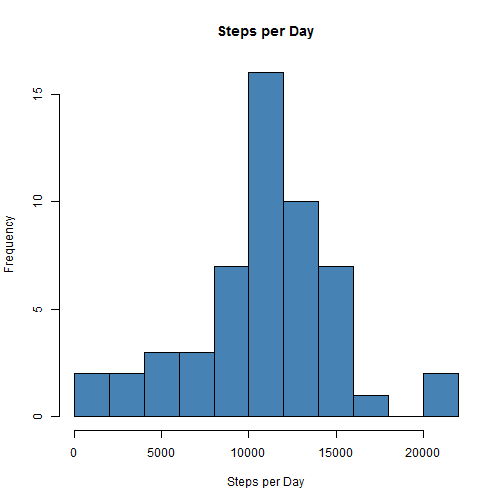
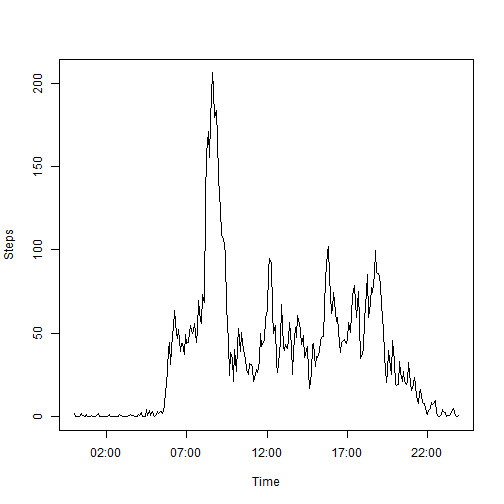
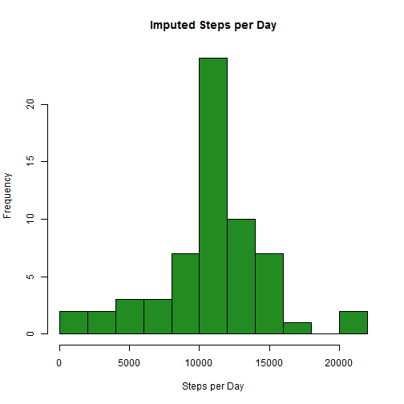
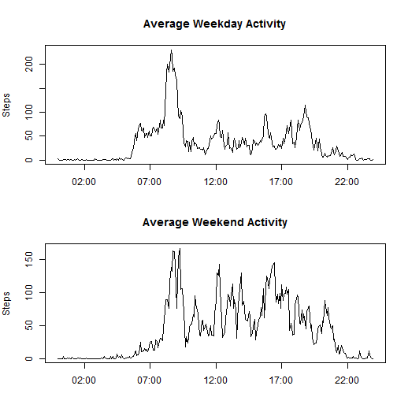

This project analyzes a data set from a personal monitoring device, which records
the number of steps a person has taken in 5 minute intervals throughout the day.

##Loading and preprocessing the data

Read the data.  Use the date and interval columns to create a Time column that
recognizes the intervals as times of day.  Use this time information to glean the 
days of the week for each recording, which will be used in later analysis.


```r
# read in the data from file
dat <- read.csv("activity.csv")
        
# add columns for time, days of the week, and weekdays which will be used later
# The sprintf function is used to make all entries in the interval column four
# characters long, so that strptime() can be used
dat$interval <- sprintf("%04d", dat$interval)
dat$time <- paste(dat$date, dat$interval)
dat$time <- strptime(dat$time, format = "%Y-%m-%d %H%M")
dat$weekday <- weekdays(dat$time)
        
weekends <- c("Saturday", "Sunday")
dat$isweekday <- factor(dat$weekday %in% weekends, 
                                levels = c(FALSE, TRUE), 
                                labels = c("weekday", "weekend")
                                )

# create a version of the table with NA values omitted        
cleandat <- na.omit(dat)
```

## What is the mean total number of steps taken per day?

To find the mean number of steps taken per day, we will use tapply to sum the number
of steps for each day, and then take the mean of those sums.  It is important to use
the clean data (NAs removed) when taking the sums, or days with all NA entries will 
be summed to 0, rather than being left as NA, which will affect the mean and median.


```r
# create vector with the number of steps taken each day
dailysteps <- tapply(cleandat$steps, cleandat$date, sum)

# create histogram
hist(dailysteps, breaks = 15, col = "steelblue", xlab = "Steps per Day",
     main = "Steps per Day")
```

 

We can find the mean number of steps taken per day.

```r
mean(dailysteps, na.rm = TRUE)
```

```
## [1] 10766.19
```

And the median number of steps taken per day.

```r
median(dailysteps, na.rm = TRUE)
```

```
## [1] 10765
```

##What is the average daily activity pattern?

To find the average number of steps per time interval we do the following...


```r
# create vector with the average number of steps for each time interval
intervalaverage <- tapply(dat$steps, dat$interval, mean, na.rm = TRUE)

# create time vector with every 5 minute interval throughout the day so that 
# our plot will know the intervals are times of day
times <- seq(ISOdatetime(2012,10,01,0,0,0), ISOdatetime(2012,10,1,23,55,0), by=(60*5))

#creat our plot, and find the interval that has the highest average value
plot(times, intervalaverage, type = "l", ylab = "Steps", xlab = "Time")
```

 

```r
which.max(intervalaverage)
```

```
## 0835 
##  104
```

We can see that the interval with the highest average number of steps is the 8:35
interval (the 104th interval in the series).

## Imputing missing values

The number of NA values in our original dataset can be found with the following...


```r
sum(is.na(dat))
```

```
## [1] 2304
```

There are 2304 NA values in our original set.

Lets replace these NA values with an estimate of what their values may have been.  I 
will use the average values for each five minute interval that I calculated earlier
as my imputed values, replacing an NA data point with the average value for that 
time interval.


```r
# create new table to hold our imputed values
imputeddat <- dat

# create vector with the values we will replace the NA values with
imputevector <- rep(intervalaverage, 61)

# replace the NA values in our new table with the corresponding values from our vector
imputeddat$steps[is.na(imputeddat$steps)] <- imputevector[is.na(dat$steps)]
```

We can now re-examine the daily number of steps taken and see how our imputed values 
have affected the distribution.


```r
# This is the same process that we used before to find daily averages
impdailysteps <- tapply(imputeddat$steps, imputeddat$date, sum)
hist(impdailysteps, breaks = 15, col = "forestgreen", xlab = "Steps per Day",
     main = "Imputed Steps per Day")
```

 

It looks as though the only real difference is that the highest frequency bin go even
taller, suggesting that the NA values were probably very clumped together on a couple
of days so that the entire day ended up being replaced with an average day.

Since we simply used the average values for each time interval, the mean of our data
will remain unchanged, as you can check.

```r
mean(impdailysteps, na.rm = TRUE)
```

```
## [1] 10766.19
```

The median simply becomes the mean.

```r
median(impdailysteps, na.rm = TRUE)
```

```
## [1] 10766.19
```

## Are there differences in activity patterns between weekdays and weekends?

The factor variable was created when the data was initially read into R.


```r
# create vector with the average number of steps for each time interval on weekdays
weekdayintav <- tapply(imputeddat$steps[imputeddat$isweekday == "weekday"], 
                       imputeddat$interval[imputeddat$isweekday == "weekday"],
                       mean, 
                       na.rm = TRUE)

# create vector for weekends
weekendintav <- tapply(imputeddat$steps[imputeddat$isweekday == "weekend"], 
                       imputeddat$interval[imputeddat$isweekday == "weekend"],
                       mean, 
                       na.rm = TRUE)

# creat our plot, and find the interval that has the highest average value. The times
# vector used was created for the last time series plot
par(mfrow = (c(2,1)), mar = c(3,4,4,1))
plot(times, weekdayintav, type = "l", ylab = "Steps", xlab = "Time", 
     main = "Average Weekday Activity")
plot(times, weekendintav, type = "l", ylab = "Steps", xlab = "Time", 
     main = "Average Weekend Activity")
```

 

We can see that the weekday activity is much more concentrated in the morning, while
activity on the weekends was more spread out throughout the day.
